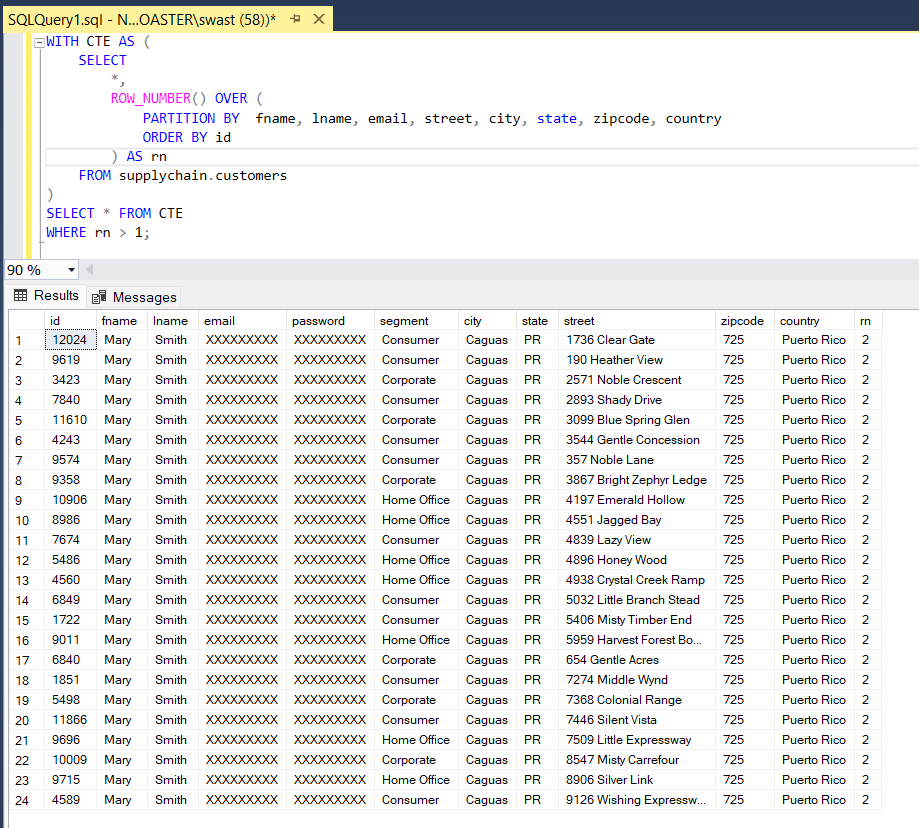
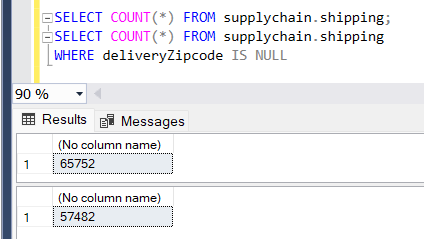
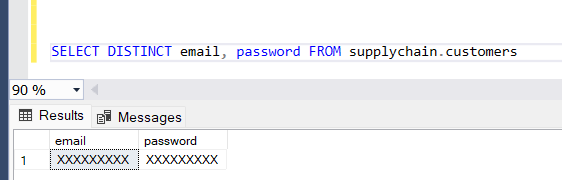

Below is a complete, detailed project report documenting the entire ETL process—from dataset details to database extraction, transformation, and backup. Every code snippet used (without inline comments) is included followed by an explanation of its output and function.

  

---

  

# Project Report: Supply Chain Management and Inventory Forecasting

  

## 1 Introduction

  

This project is an enterprise-level supply chain management and inventory forecasting solution. Our primary data source is the **DataCo Supply Chain Dataset**, which comprises two CSV files:

-  **DataCoSupplyChainDataset.csv**

-  **tokenized_access_logs.csv**

  

The dataset contains transactional, customer, product, and shipping details across 52 columns. It is a real-world, denormalized, and noisy dataset requiring heavy preprocessing. An ETL (Extract, Transform, Load) pipeline was built to clean, normalize, and load the data into an MS SQL Server database.

## Questions Answered
Below is a comprehensive, domain-rich list of questions you can answer with your data, organized under subheadings. Each question includes an explanation and a suggested solution—detailing which tables and columns to query and what operations (joins, aggregations, filtering, etc.) you might perform to get the answer.

---

### **1. Demand Forecasting & Inventory Optimization**

**Question 1: What will be the demand for each product over the next quarter?**  
- **Explanation:**  
  Forecasting future product demand is critical to avoid stockouts and excess inventory. This involves analyzing historical sales patterns, seasonal trends, and order volumes.  
- **Suggested Solution:**  
  - **Tables/Columns:** Use the `orders` and `order_items` tables (columns: `orderDate` from orders; `productId`, `quantity`, `sales` from order_items).  
  - **Operations:**  
    - **Join** orders with order_items on `orderId`.  
    - **Group** data by `productId` and time intervals (e.g., monthly).  
    - **Aggregate** sums of `quantity` or `sales` to establish historical demand trends.  
    - Apply time-series forecasting models (like ARIMA or Prophet) outside SQL to predict next-quarter demand.


**Question 2: What seasonal trends affect product demand across various categories?**  
- **Explanation:**  
  Understanding seasonality helps in planning inventory and promotions. You can analyze how demand changes by month or quarter for each category.  
- **Suggested Solution:**  
  - **Tables/Columns:** Use the `orders` table (columns: `orderDate`) joined with the `order_items` table (columns: `productId`, `quantity`) and further join with `products` or `categories` (columns: `categoryId`, `name`).  
  - **Operations:**  
    - **Extract** month/quarter from `orderDate`.  
    - **Group** by category and time period.  
    - **Aggregate** sales or quantities.  
    - Visualize these trends to identify seasonality.


### **2. Logistics & Transportation Efficiency**

**Question 3: How do actual shipping days compare with scheduled shipping days across different shipping modes and markets?**  
- **Explanation:**  
  Evaluating the variance between actual and scheduled shipping times reveals delivery performance and potential bottlenecks in logistics.  
- **Suggested Solution:**  
  - **Tables/Columns:** Use the `shipping` table (columns: `shippingMode`, `actualShippingDays`, `scheduledShippingDays`, `market`).  
  - **Operations:**  
    - **Calculate** the difference between actual and scheduled days.  
    - **Group** by `shippingMode` and `market`.  
    - **Aggregate** average differences to highlight performance gaps.


**Question 4: What percentage of orders are delivered late, and how does this vary by market?**  
- **Explanation:**  
  Late deliveries can impact customer satisfaction. Identifying the percentage of late deliveries by market informs targeted operational improvements.  
- **Suggested Solution:**  
  - **Tables/Columns:** Use the `shipping` table (columns: `deliveryStatus`, `lateDeliveryRisk`, `market`).  
  - **Operations:**  
    - **Filter** records where `lateDeliveryRisk = 1` or `deliveryStatus = 'Late delivery'`.  
    - **Group** by `market`.  
    - **Calculate** the percentage of late deliveries within each market.


### **3. Customer Satisfaction & Service Level Analysis**

**Question 5: How does delivery performance (e.g., shipping days, on-time delivery) vary by customer geography?**  
- **Explanation:**  
  Delivery performance can be tied to customer satisfaction. Analyzing geographic patterns helps understand regional operational challenges.  
- **Suggested Solution:**  
  - **Tables/Columns:** Join `orders` (columns: `id`, `orderDate`), `shipping` (columns: `orderId`, `actualShippingDays`, `scheduledShippingDays`, `deliveryStatus`), and `customers` (columns: `id`, `city`, `state`, `country`).  
  - **Operations:**  
    - **Join** orders with shipping on `orderId`, and orders with customers on `customerId`.  
    - **Group** by geographic attributes (`city`, `state`, `country`).  
    - **Aggregate** metrics such as average shipping delay and on-time delivery percentage.


### **4. Warehouse & Distribution Optimization**

**Question 6: Which regions exhibit the highest order volumes and might benefit from additional warehouse capacity?**  
- **Explanation:**  
  Understanding geographic demand is key to optimizing distribution networks and selecting new warehouse locations.  
- **Suggested Solution:**  
  - **Tables/Columns:** Use the `shipping` table (columns: `deliveryRegion`, `deliveryCity`) and/or `orders` (if linked with geographic info through customers).  
  - **Operations:**  
    - **Group** orders or shipments by `deliveryRegion` (or `city`).  
    - **Aggregate** the count of orders.  
    - **Rank** regions by order volume to identify hotspots.


### **5. Cost Reduction & Efficiency Improvement**

**Question 7: Which product lines (SKUs) deliver the highest profit margins, and how do discounts impact overall profitability?**  
- **Explanation:**  
  Analyzing profitability at the SKU level helps in optimizing pricing strategies and discount policies.  
- **Suggested Solution:**  
  - **Tables/Columns:** Use `order_items` (columns: `productId`, `productPrice`, `discount`, `profitRatio`, `benefitPerOrder`, `orderProfitPerOrder`, `quantity`, `amount`, `sales`) joined with `products` (columns: `id`, `name`) and `categories` (columns: `id`, `name`).  
  - **Operations:**  
    - **Group** by `productId` (or by SKU) and calculate average profit metrics.  
    - **Compare** results with discount rates to assess the impact on profitability.


### **6. Risk Management & Supply Chain Resilience**

**Question 8: What are the bottlenecks in our transportation network as evidenced by shipping delays?**  
- **Explanation:**  
  Delays in shipping often signal process inefficiencies or capacity issues that may pose risks to supply chain resilience.  
- **Suggested Solution:**  
  - **Tables/Columns:** Use `shipping` (columns: `shippingMode`, `actualShippingDays`, `scheduledShippingDays`, `lateDeliveryRisk`) and `orders` (for temporal context via `orderDate`).  
  - **Operations:**  
    - **Calculate** delay differences and flag outliers.  
    - **Group** by `shippingMode` and analyze the variance in shipping times to detect bottlenecks.


### **7. Predictive & Prescriptive Analytics**

**Question 9: What are the optimal reorder points and safety stock levels for different SKUs based on historical demand?**  
- **Explanation:**  
  Determining the right inventory levels minimizes both stockouts and excess inventory.  
- **Suggested Solution:**  
  - **Tables/Columns:** Use `order_items` (columns: `productId`, `quantity`, `sales`) and `orders` (columns: `orderDate`).  
  - **Operations:**  
    - **Aggregate** historical sales data by product and time period.  
    - Use statistical or machine learning models (outside SQL, e.g., ARIMA, exponential smoothing) to forecast future demand and recommend reorder points.


### **8. Customer Segmentation & Order Cycle Analysis**

**Question 10: Which customer segments generate the highest order frequency and revenue, and how do their order cycles differ?**  
- **Explanation:**  
  Segmenting customers by order frequency and revenue helps tailor marketing strategies and improve service levels.  
- **Suggested Solution:**  
  - **Tables/Columns:** Use `customers` (columns: `id`, `segment`), `orders` (columns: `customerId`, `orderDate`, `status`), and optionally `order_items` (for revenue).  
  - **Operations:**  
    - **Join** customers with orders.  
    - **Group** by `segment`.  
    - **Aggregate** metrics like total orders, average order value, and order cycle time (difference between consecutive orders).  
    - Analyze segmentation differences to inform targeted strategies.


---

  

## 2. Data Source Details

  

### DataCoSupplyChainDataset.csv Columns (52 Columns)

  

-  **Type:** Type of transaction made

-  **Days for shipping (real):** Actual shipping days of the purchased product

-  **Days for shipment (scheduled):** Days of scheduled delivery of the purchased product

-  **Benefit per order:** Earnings per order placed

-  **Sales per customer:** Total sales per customer

-  **Delivery Status:** Delivery status of orders – Advance shipping, Late delivery, Shipping canceled, Shipping on time

-  **Late_delivery_risk:** Categorical variable indicating if shipment is late (1) or not (0)

-  **Category Id:** Product category code

-  **Category Name:** Description of the product category

-  **Customer City:** City where the customer made the purchase

-  **Customer Country:** Country where the customer made the purchase

-  **Customer Email:** Customer's email

-  **Customer Fname:** Customer first name

-  **Customer Id:** Customer ID

-  **Customer Lname:** Customer last name

-  **Customer Password:** Masked customer key

-  **Customer Segment:** Types of customers (Consumer, Corporate, Home Office)

-  **Customer State:** State of the registered store

-  **Customer Street:** Street of the registered store

-  **Customer Zipcode:** Customer zipcode

-  **Department Id:** Department code of the store

-  **Department Name:** Department name

-  **Latitude:** Latitude of the store

-  **Longitude:** Longitude of the store

-  **Market:** Delivery market (Africa, Europe, LATAM, Pacific Asia, USCA)

-  **Order City:** Destination city of the order

-  **Order Country:** Destination country of the order

-  **Order Customer Id:** Customer order code

-  **order date (DateOrders):** Date when the order is made

-  **Order Id:** Order code

-  **Order Item Cardprod Id:** Product code generated by the RFID reader

-  **Order Item Discount:** Order item discount value

-  **Order Item Discount Rate:** Order item discount percentage

-  **Order Item Id:** Order item code

-  **Order Item Product Price:** Product price (without discount)

-  **Order Item Profit Ratio:** Profit ratio per order item

-  **Order Item Quantity:** Number of products per order

-  **Sales:** Total sales value

-  **Order Item Total:** Total order amount

-  **Order Profit Per Order:** Profit per order

-  **Order Region:** Region where the order is delivered

-  **Order State:** State in the delivery region

-  **Order Status:** Order status (COMPLETE, PENDING, CLOSED, PENDING_PAYMENT, CANCELED, PROCESSING, SUSPECTED_FRAUD, ON_HOLD, PAYMENT_REVIEW)

-  **Product Card Id:** Product code

-  **Product Category Id:** Product category code

-  **Product Description:** Description of the product

-  **Product Image:** Link to product image

-  **Product Name:** Name of the product

-  **Product Price:** Product price

-  **Product Status:** Stock status (1 = Not available, 0 = Available)

-  **Shipping date (DateOrders):** Exact date and time of shipment

-  **Shipping Mode:** Shipping mode (Standard Class, First Class, Second Class, Same Day)

  

### tokenized_access_logs.csv Columns

  

-  **Product:** Product identifier

-  **Category:** Category identifier

-  **Date:** Log date

-  **Month:** Log month

-  **Hour:** Log hour

-  **Department:** Department information

-  **ip:** IP address

-  **url:** URL accessed

  

---

  

## 3. ETL Process Overview

  

The ETL process consists of the following phases:

  

1.  **Extraction**

- Identification of sources (CSV files)

- Loading data using SQL Server Import Wizard into staging tables

- Validation of row counts and structure

  

2.  **Transformation & Data Cleansing**

- Removing duplicates and filtering errors

- Handling missing and invalid data

- Standardizing data types and formats

- Normalizing the denormalized data into logical tables

- Enriching data with derived columns and business rules

  

3.  **Backup**

- Creating backup copies of normalized tables for recovery and audit purposes

  

At the start of the transformation stage (and after extraction), a database diagram is provided that shows the relationships among tables. (Please refer to the attached diagram image for a visual representation of table relationships.)

  

---

  

## 4. Extraction Process

#### Source Identification:

  

**DataCoSupplyChainDataset.csv:** Contains all transactional, customer, product, and shipping data.

**tokenized_access_logs.csv:** Contains system or user activity logs.

  

#### Extraction Method:

  

**Pull:** You’re pulling data from a CSV file (file parsing) into SQL Server.

Extraction Type:

  

**Full Extraction:** You imported the complete CSV file into staging tables.

  

#### Extraction Technique:

  

**Manual File Parsing:** Using SQL Server Import Wizard to load the CSVs into:

  

staging.supply_chain_data

  

logs.access_logs

  

---

  

### 4.1 Creating Database and Schemas

  

```sql

CREATE  DATABASE  DataCo;

USE  DATABASE DataCo;

CREATE  SCHEMA  staging;

CREATE  SCHEMA  supplychain;

CREATE  SCHEMA  logs;

CREATE  SCHEMA  backups;

```

  

**Explanation:**

This code creates a new database called **DataCo** in MS SQL Server and switches the session to that database. Four schemas are then created:

-  **staging:** for raw imported data

-  **supplychain:** for normalized and transformed tables

-  **logs:** for access logs data

-  **backups:** for storing backup copies of tables

  

---

  

### 4.2 Importing CSV Files and Validating Row Counts

  

After importing the CSV files using the SQL Server Import Wizard, the following queries verify the number of rows imported:

  

```sql

SELECT  COUNT(*) FROM staging.SupplyChainData;

SELECT  COUNT(*) FROM logs.AccessLogs;

```

  

**Explanation:**

- The first query counts the rows in the **staging.SupplyChainData** table. The expected output is **180519** rows corresponding to the DataCoSupplyChainDataset.csv file.

- The second query counts the rows in the **logs.AccessLogs** table. The expected output is **469977** rows from the tokenized_access_logs.csv file.

  

---

  

### 4.3 Checking Table Structure

  

#### Structure of the Supply Chain Data Table

  

```sql

SELECT COLUMN_NAME, DATA_TYPE, CHARACTER_MAXIMUM_LENGTH, IS_NULLABLE

FROM INFORMATION_SCHEMA.COLUMNS

WHERE TABLE_SCHEMA = 'staging'  AND TABLE_NAME = 'SupplyChainData';

```

  

**Explanation:**

This query retrieves metadata (column name, data type, maximum character length, and nullability) for each column in the **staging.SupplyChainData** table. The output displays all 52 columns with their respective SQL data types and constraints.

  

#### Structure of the Access Logs Table

  

```sql

SELECT COLUMN_NAME, DATA_TYPE, CHARACTER_MAXIMUM_LENGTH, IS_NULLABLE

FROM INFORMATION_SCHEMA.COLUMNS

WHERE TABLE_SCHEMA = 'logs'  AND TABLE_NAME = 'AccessLogs';

```

  

**Explanation:**

This query retrieves metadata for the **logs.AccessLogs** table. The output lists each column (Product, Category, Date, Month, Hour, Department, ip, url) along with its data type, maximum character length, and nullability.

  

---

  

## 5. Transformation & Data Cleansing Process

  

### 5.0. Database Diagram

This diagram illustrates the database structure for the supplyChain schema that we will have at the end of the ETL pipeline. Each relationship is defined via primary and foreign keys to enforce referential integrity. (Please see the attached diagram image for a visual representation.)

  


---

The following sections detail the creation of normalized tables and the population of these tables from the staging data.

  
  

### 5.1 DATA MODELING

  

#### 5.1.1 Departments Table

  

```sql

CREATE  TABLE  supplychain.departments (

id INT  PRIMARY KEY,

name  VARCHAR(50) NOT NULL  UNIQUE

);

```

  

**Explanation:**

This statement creates the **departments** table in the **supplychain** schema. It includes an **id** as the primary key and a **name** column which is unique and cannot be null.

  

---

  

#### 5.1.2 Department Locations Table

  

```sql

CREATE  TABLE  supplychain.department_locations (

location_id INT  IDENTITY(1,1) PRIMARY KEY,

departmentId INT  NOT NULL,

latitude FLOAT  NOT NULL,

longitude FLOAT  NOT NULL,

CONSTRAINT FK_department_locations_departments FOREIGN KEY (departmentId) REFERENCES supplychain.departments(id)

);

```

  

**Explanation:**

This query creates the **department_locations** table, storing geographical coordinates for departments. The **location_id** is an identity primary key. The **departmentId** is a foreign key referencing the **departments** table.

  

---

  

#### 5.1.3 Categories Table

  

```sql

CREATE  TABLE  supplychain.categories (

id INT  PRIMARY KEY,

name  VARCHAR(50) NOT NULL,

status  BIT  NOT NULL

);

```

  

**Explanation:**

The **categories** table is created with an **id** as the primary key, a **name** column, and a **status** column (with BIT data type where 1 indicates “Not available” and 0 indicates “Available”).

  

---

  

#### 5.1.4 Category-Department Relationship Table

  

```sql

CREATE  TABLE  supplychain.category_department (

categoryId INT  NOT NULL,

departmentId INT  NOT NULL,

PRIMARY KEY (categoryId, departmentId),

FOREIGN KEY (categoryId) REFERENCES supplychain.categories(id),

FOREIGN KEY (departmentId) REFERENCES supplychain.departments(id)

);

```

  

**Explanation:**

This table establishes a many-to-many relationship between categories and departments. The composite primary key is formed by **categoryId** and **departmentId**, with both columns referencing their respective parent tables.

  

---

  

#### 5.1.5 Customers Table

  

```sql

CREATE  TABLE  supplychain.customers (

id INT  PRIMARY KEY,

fname VARCHAR(50) NOT NULL,

lname VARCHAR(50),

email VARCHAR(10) NOT NULL,

password  VARCHAR(10) NOT NULL,

segment VARCHAR(30) NOT NULL,

city VARCHAR(50) NOT NULL,

state  VARCHAR(50) NOT NULL,

street VARCHAR(100) NOT NULL,

zipcode INT,

country VARCHAR(50) NOT NULL

);

```

  

**Explanation:**

This statement creates the **customers** table to store customer information. It includes columns for first name, last name, email, password, segment, address details, and a primary key (**id**).

  

---

  

#### 5.1.6 Products Table

  

```sql

CREATE  TABLE  supplychain.products (

id INT  PRIMARY KEY,

name  VARCHAR(100) NOT NULL,

description  VARCHAR(255),

image  VARCHAR(255),

price FLOAT  NOT NULL,

categoryId INT  NOT NULL,

FOREIGN KEY (categoryId) REFERENCES supplychain.categories(id)

);

```

  

**Explanation:**

The **products** table is created to store product information. It contains an **id** as primary key, along with details such as name, description, image link, price, and a foreign key (**categoryId**) linking to the **categories** table.

  

---

  

#### 5.1.7 Orders Table

  

```sql

CREATE  TABLE  supplychain.orders (

id INT  PRIMARY KEY,

customerId INT  NOT NULL,

orderDate VARCHAR(50) NOT NULL,

status  VARCHAR(30) NOT NULL  CHECK (

status  IN ('COMPLETE', 'PENDING', 'CLOSED', 'PENDING_PAYMENT', 'CANCELED', 'PROCESSING', 'SUSPECTED_FRAUD', 'ON_HOLD', 'PAYMENT_REVIEW')

),

FOREIGN KEY (customerId) REFERENCES supplychain.customers(id)

);

```

  

**Explanation:**

This query creates the **orders** table. It stores order details including a primary key (**id**), a foreign key (**customerId**) linking to the **customers** table, the order date, and a status constrained to specific values.

  

---

  

#### 5.1.8 Order Items Table

  

```sql

CREATE  TABLE  supplychain.order_items (

id INT  PRIMARY KEY,

orderId INT  NOT NULL,

productId INT  NOT NULL,

discount FLOAT  DEFAULT  0,

discountRate FLOAT  DEFAULT  0,

productPrice FLOAT  NOT NULL,

profitRatio FLOAT,

benefitPerOrder FLOAT,

orderProfitPerOrder FLOAT,

quantity INT  NOT NULL  CHECK (quantity > 0),

amount FLOAT  NOT NULL,

sales FLOAT,

FOREIGN KEY (orderId) REFERENCES supplychain.orders(id) ON DELETE CASCADE,

FOREIGN KEY (productId) REFERENCES supplychain.products(id)

);

```

  

**Explanation:**

The **order_items** table stores details for each order item. It contains references to the **orders** and **products** tables. A check constraint ensures that **quantity** is greater than 0. Default values for discount and discount rate are set to 0.

  

---

  

#### 5.1.9 Shipping Table

  

```sql

CREATE  TABLE  supplychain.shipping (

id INT  PRIMARY KEY,

orderId INT  NOT NULL,

shippingDate VARCHAR(50) NOT NULL,

shippingMode VARCHAR(20) NOT NULL  CHECK (

shippingMode IN ('Standard Class', 'First Class', 'Second Class', 'Same Day')

),

actualShippingDays INT  NOT NULL,

scheduledShippingDays INT  NOT NULL,

deliveryStatus VARCHAR(50) NOT NULL  CHECK (

deliveryStatus IN ('Advance shipping', 'Late delivery', 'Shipping canceled', 'Shipping on time')

),

lateDeliveryRisk BIT  NOT NULL,

market VARCHAR(50) NOT NULL  CHECK (

market IN ('Africa', 'Europe', 'LATAM', 'Pacific Asia', 'USCA')

),

deliveryRegion VARCHAR(50) NOT NULL,

deliverySate VARCHAR(50) NOT NULL,

deliveryCountry VARCHAR(50) NOT NULL,

deliveryCity VARCHAR(50) NOT NULL,

deliveryZipcode INT,

FOREIGN KEY (orderId) REFERENCES supplychain.orders(id) ON DELETE CASCADE

);

```

  

**Explanation:**

The **shipping** table holds shipping details linked to orders. It includes shipping dates, modes (constrained to a set list), actual and scheduled shipping days, delivery status, late delivery risk flag, market information, and delivery address details. The foreign key ensures referential integrity with the **orders** table.

  

---

  

#### 5.1.10 Inserting Data into Departments

  

```sql

INSERT INTO supplychain.departments (id, name)

SELECT DISTINCT

Department_Id,

Department_Name

FROM staging.SupplyChainDataset

WHERE Department_Id IS NOT NULL;

GO

```

  

**Explanation:**

This query populates the **departments** table by selecting distinct department IDs and names from the staging table. Only records with non-null **Department_Id** are inserted. The use of **DISTINCT** ensures duplicates are eliminated.

  

---

  

#### 5.1.12 Inserting Data into Department Locations

  

```sql

INSERT INTO supplychain.department_locations (departmentId, latitude, longitude)

SELECT DISTINCT

Department_Id,

Latitude,

Longitude

FROM staging.SupplyChainDataset

WHERE Department_Id IS NOT NULL;

GO

```

  

**Explanation:**

This statement populates the **department_locations** table with distinct department IDs and their corresponding latitude and longitude values from the staging data. This creates the geographic mapping for each department.

  

---

  

#### 5.1.13 Inserting Data into Customers

  

```sql

INSERT INTO supplychain.customers (id, fname, lname, email, password, segment, city, state, street, zipcode, country)

SELECT DISTINCT

Customer_Id,

Customer_Fname,

Customer_Lname,

Customer_Email,

Customer_Password,

Customer_Segment,

Customer_City,

Customer_State,

Customer_Street,

Customer_Zipcode,

Customer_Country

FROM staging.SupplyChainDataset

WHERE Customer_Id IS NOT NULL;

GO

```

  

**Explanation:**

This query inserts distinct customer records into the **customers** table. It extracts customer details from the staging table, ensuring only valid records (non-null **Customer_Id**) are included.

  

---

  

#### 5.1.14 Inserting Data into Categories

  

```sql

INSERT INTO supplychain.categories (id, name, status)

SELECT DISTINCT

Category_Id,

Category_Name,

Product_Status

FROM staging.SupplyChainDataset

WHERE Category_Id IS NOT NULL;

```

  

**Explanation:**

This statement populates the **categories** table by selecting unique category IDs, names, and product status from the staging dataset. Only non-null **Category_Id** records are processed.

  

---

  

#### 5.1.15 Inserting Data into Category_Department

  

```sql

INSERT INTO supplychain.category_department (categoryId, departmentId)

SELECT DISTINCT Category_Id, Department_Id

FROM staging.SupplyChainDataset

WHERE Category_Id IS NOT NULL  AND Department_Id IS NOT NULL;

```

  

**Explanation:**

This query creates mappings between categories and departments in the **category_department** table by selecting distinct combinations of category and department IDs from the staging data.

  

---

  

#### 5.1.16 Inserting Data into Products

  

```sql

INSERT INTO supplychain.products (id, name, description, image, price, categoryId)

SELECT DISTINCT

Product_Card_Id,

Product_Name,

Product_Description,

Product_Image,

Product_Price,

Product_Category_Id

FROM staging.SupplyChainDataset

WHERE Product_Card_Id IS NOT NULL;

GO

```

  

**Explanation:**

This statement populates the **products** table by selecting distinct product records. It extracts product codes, names, descriptions, image URLs, prices, and category IDs from the staging data, inserting only non-null product codes.

  

---

  

#### 5.1.17 Inserting Data into Orders

  

```sql

INSERT INTO supplychain.orders (id, customerId, orderDate, status)

SELECT DISTINCT

Order_Id,

Order_Customer_Id,

order_date_DateOrders,

Order_Status

FROM staging.SupplyChainDataset

WHERE Order_Id IS NOT NULL;

GO

```

  

**Explanation:**

This query loads the **orders** table with distinct order records from the staging data. It uses non-null **Order_Id** values and includes the customer order code, order date, and order status.

  

---

  

#### 5.1.18 Inserting Data into Order Items

  

```sql

INSERT INTO supplychain.order_items (id, orderId, productId, discount, discountRate, productPrice, profitRatio, benefitPerOrder, orderProfitPerOrder, quantity, amount, sales)

SELECT DISTINCT

Order_Item_Id,

Order_Id,

Order_Item_Cardprod_Id,

Order_Item_Discount,

Order_Item_Discount_Rate,

Order_Item_Product_Price,

Order_Item_Profit_Ratio,

Benefit_per_order,

Order_Profit_Per_Order,

Order_Item_Quantity,

Order_Item_Total,

Sales

FROM staging.SupplyChainDataset

WHERE Order_Item_Id IS NOT NULL;

GO

```

  

**Explanation:**

This statement inserts order item details into the **order_items** table. It extracts various measures (discounts, profit ratios, quantities, amounts, etc.) from the staging table while ensuring that only records with a non-null **Order_Item_Id** are processed.

  

---

  

#### 5.1.19 Inserting Data into Shipping

  

```sql

INSERT INTO supplychain.shipping

(id, orderId, shippingDate, shippingMode, actualShippingDays, scheduledShippingDays, deliveryStatus, lateDeliveryRisk, market, deliveryRegion, deliverySate, deliveryCountry, deliveryCity, deliveryZipcode)

SELECT DISTINCT

ROW_NUMBER() OVER (ORDER BY Order_Id) AS id,

Order_Id,

Shipping_date_DateOrders,

Shipping_Mode,

Days_for_shipping_real,

Days_for_shipment_scheduled,

Delivery_Status,

Late_delivery_risk,

Market,

Order_Region,

Order_State,

Order_Country,

Order_City,

Order_Zipcode

FROM staging.SupplyChainDataset

WHERE Order_Id IS NOT NULL;

GO

```

  

**Explanation:**

This query populates the **shipping** table. A surrogate key is generated using `ROW_NUMBER()`. It extracts shipping-related fields such as shipping date, mode, actual and scheduled days, delivery status, late delivery risk, market, and full delivery address information from the staging table.

  

---

  

#### 5.1.20 Backup the tables

  

To safeguard the normalized data, backups of all tables in the **supplychain** schema are created with the following code:

  

```sql
DECLARE @TableName NVARCHAR(255);
DECLARE @SQL NVARCHAR(MAX);

IF NOT EXISTS (SELECT * FROM sys.schemas WHERE name = 'backups')
BEGIN
    EXEC('CREATE SCHEMA backups');
END

DECLARE db_cursor CURSOR FOR
SELECT TABLE_NAME 
FROM INFORMATION_SCHEMA.TABLES 
WHERE TABLE_SCHEMA = 'supplychain';

OPEN db_cursor;
FETCH NEXT FROM db_cursor INTO @TableName;

WHILE @@FETCH_STATUS = 0
BEGIN
    SET @SQL = 'DROP TABLE IF EXISTS backups.' + QUOTENAME(@TableName) + ';
                SELECT * INTO backups.' + QUOTENAME(@TableName) + ' FROM supplychain.' + QUOTENAME(@TableName) + ';';
    
    PRINT @SQL;
    EXEC sp_executesql @SQL;

    FETCH NEXT FROM db_cursor INTO @TableName;
END

CLOSE db_cursor;
DEALLOCATE db_cursor;
```

  

**Explanation:**

This block declares variables and uses a cursor to iterate over each table in the **supplychain** schema. For every table found, it dynamically builds and executes a SQL statement to create a backup copy in the **backups** schema. The result is a set of backup tables that mirror the original normalized tables.

  

---

  

Below is a detailed project report covering our normalization, duplicate removal, and data filtering checks and corrections. Each section contains the SQL code we executed (without inline comments) followed by an explanation of its output and the business logic behind our decisions. We focus our normalization efforts up to Third Normal Form (3NF) because it eliminates duplicate data and transitive dependencies while maintaining acceptable performance and meeting our enterprise reporting requirements.

  

---

  

### 5.2 DATA NORMALIZATION

  

#### 5.2.1 Checking First Normal Form (1NF)

  

```sql

SELECT t.name AS TableName

FROM sys.tables t

LEFT JOIN sys.indexes i ON t.object_id = i.object_id AND i.is_primary_key = 1

WHERE i.object_id IS  NULL;

```

  

**Output 1NF:**

```

SupplyChainDataset

categories

category_department

customers

department_locations

departments

order_items

orders

products

shipping

AccessLogs

```

  

**Explanation:**

This query returns the list of tables that currently do not have a primary key defined. In our case, several staging and operational tables (including the denormalized SupplyChainDataset and even some normalized tables) appear. For our transformed tables, we have later defined primary keys to satisfy 1NF. This check helps us ensure that each table has a unique identifier.

  

---

  

### 5.2.2 Checking Second Normal Form (2NF)

  

#### 5.2.2.1 Querying for Tables with Composite Keys

  

```sql

SELECT t.name AS TableName, i.name AS IndexName, STRING_AGG(c.name, ', ') AS PrimaryKeyColumns

FROM sys.tables t

JOIN sys.indexes i ON t.object_id = i.object_id AND i.is_primary_key = 1

JOIN sys.index_columns ic ON i.object_id = ic.object_id AND i.index_id = ic.index_id

JOIN sys.columns c ON ic.object_id = c.object_id AND ic.column_id = c.column_id

GROUP BY t.name, i.name

HAVING  COUNT(c.name) > 1;

```

  

**Output 2NF:**

```

TableName: category_department

IndexName: PK__category__EC51729E503F32E7

PrimaryKeyColumns: categoryId, departmentId

```

  

**Explanation:**

This query filters for tables with composite primary keys (i.e., more than one column in the key). The output indicates that the **category_department** table uses a composite key made of _categoryId_ and _departmentId_. While composite keys require careful design to avoid partial dependency (a key requirement for 2NF), in our case the table only contains these two columns as a linking table. Thus, it meets 2NF.

  

#### 5.2.2.2 Verifying No Non‑Key Column Is Left Out

  

```sql

SELECT c.TABLE_NAME, c.COLUMN_NAME

FROM INFORMATION_SCHEMA.COLUMNS c

WHERE c.TABLE_NAME IN (

SELECT t.name FROM sys.tables t

JOIN sys.indexes i ON t.object_id = i.object_id AND i.is_primary_key = 1

JOIN sys.index_columns ic ON i.object_id = ic.object_id AND i.index_id = ic.index_id

GROUP BY t.name HAVING  COUNT(ic.index_id) > 1

)

AND c.COLUMN_NAME NOT  IN (

SELECT COLUMN_NAME FROM INFORMATION_SCHEMA.KEY_COLUMN_USAGE

);

```

  

**Explanation:**

This query cross-checks columns in tables having composite keys to see if any column is not part of a key. Finding no extra non‑key columns in these linking tables confirms that 2NF is satisfied—each non‑key attribute fully depends on the whole primary key.

  

---

  

### 5.2.3 Checking Third Normal Form (3NF)

  

We then verified that no transitive dependencies exist by grouping non‑key attributes across key tables. For example, we checked the relationships between product, customer, shipping, and category attributes.

  

```sql

SELECT

categoryId,

COUNT(DISTINCT  name) AS distinct_status_count

FROM supplychain.products

GROUP BY categoryId;

  

SELECT

country,

COUNT(DISTINCT segment) AS distinct_segment_count

FROM supplychain.customers

GROUP BY country;

  

SELECT

market,

COUNT(DISTINCT deliveryRegion) AS region_count,

COUNT(DISTINCT deliverySate) AS state_count,

COUNT(DISTINCT deliveryCountry) AS country_count,

COUNT(DISTINCT deliveryCity) AS city_count,

COUNT(DISTINCT deliveryZipcode) AS zipcode_count

FROM supplychain.shipping

GROUP BY market;

  

SELECT  COUNT(id), name  FROM supplychain.categories

GROUP BY  name;

```

  

**Output 3NF (summarized):**

```

2 2

3 3

4 3

5 2

6 1

7 3

9 2

10 3

11 2

12 3

13 4

16 1

17 2

18 1

24 1

26 4

29 3

30 4

31 3

32 3

33 4

34 1

35 7

36 5

37 7

38 8

40 6

41 4

43 1

44 3

45 1

46 1

48 2

59 1

60 1

61 1

62 1

63 1

64 1

65 1

66 1

67 1

68 1

69 1

70 1

71 1

72 1

73 1

74 1

75 1

76 1

```

  

**Explanation:**

Each query groups data by a candidate key (such as _categoryId_ for products or _country_ for customers) and counts distinct values of another attribute. The counts show no unexpected multiplicitiy that would indicate transitive dependencies. For instance, the categories table shows that each category name is associated with a unique identifier once we correct duplicates. Because our analysis shows that every non‑key attribute depends solely on the primary key, our tables satisfy 3NF. We stop at 3NF as it provides a good balance between eliminating redundancy and maintaining query performance.

  

---

  

### 5.3 DUPLICATE REMOVAL AND NORMALIZATION CORRECTIONS

  

#### 5.3.1 Duplicate Categories – Problem and Verification

  

Some categories appeared more than once with the same name. We identified these duplicates with:

  

```sql

SELECT  COUNT(id), name  FROM supplychain.categories

GROUP BY  name

HAVING  COUNT(id) > 1;

```

  


  

**Explanation:**

This result shows that—for example—the name "Clothing" appears with three different IDs, and "Electronics" appears three times. This indicates duplicate or misassigned category IDs. We decided to retain the minimum ID as the representative for each name and update the affected tables accordingly.

  

#### 5.3.2 Manual Corrections in Categories

  

To fix misassignments (for instance, category ID 13 and 37 both had the name "Electronics" but should be reclassified), we ran:

  

```sql

UPDATE supplyChain.categories

SET  name = 'Sports Equipment'

WHERE id = 13;

  

UPDATE supplyChain.categories

SET  name = 'Golf Equipment'

WHERE id = 37;

  

UPDATE supplyChain.categories

SET  name = 'Golf Equipment'

WHERE id = 40;

```

  

**Explanation:**

These updates correct the category names so that the data accurately reflects the intended product classifications. Such corrections ensure consistency across related tables.

  

#### 5.3.3 Checking Foreign Key Constraints on Categories

  

```sql

SELECT  name  AS constraint_name, OBJECT_NAME(parent_object_id) AS table_name

FROM sys.foreign_keys

WHERE referenced_object_id = OBJECT_ID('supplychain.categories');

```

  

**Explanation:**

This query returns the names of foreign key constraints referencing the **categories** table. It confirms which tables (such as **products** and **category_department**) rely on the categories’ IDs. This information is essential before making bulk updates.

  

#### 5.3.4 Fixing Orphaned Rows in category_department and products

  

First, we check for orphan rows in **category_department**:

  

```sql

SELECT cd.*

FROM supplychain.category_department cd

LEFT JOIN supplychain.categories c

ON cd.categoryId = c.id

WHERE c.id IS  NULL;

```

  

**Explanation:**

Any returned rows would indicate that some category IDs in the **category_department** table do not exist in **categories**. We then update those rows using a temporary mapping.

  

Next, we update and delete orphan rows:

  

```sql

UPDATE cd

SET cd.categoryId = cm.rep_id

FROM supplychain.category_department cd

JOIN supplychain.categories c

ON cd.categoryId = c.id

JOIN #CategoryMapping cm

ON c.name = cm.name

WHERE cd.categoryId NOT  IN (SELECT id FROM supplychain.categories);

  

DELETE  FROM supplychain.category_department

WHERE categoryId NOT  IN (SELECT id FROM supplychain.categories);

  

SELECT p.*

FROM supplychain.products p

LEFT JOIN supplychain.categories c

ON p.categoryId = c.id

WHERE c.id IS  NULL;

  

DELETE  FROM supplychain.products

WHERE categoryId NOT  IN (SELECT id FROM supplychain.categories);

```

  


  


  

**Explanation:**

Output 1 shows a set of mismatched category_department records (for example, category IDs that did not properly match a valid category). After performing the update and deletion, Output 2 returns blank—meaning no orphan rows remain. We then follow a similar process in the **products** table.

  

#### 5.3.5 Consolidating Duplicates with a Temporary Mapping Table

  

We create a temporary mapping table to hold the unique (representative) category IDs for each category name:

  

```sql

IF  OBJECT_ID('tempdb..#CategoryMapping') IS NOT NULL

DROP  TABLE #CategoryMapping;

  

SELECT

name,

MIN(id) AS rep_id

INTO #CategoryMapping

FROM supplychain.categories

GROUP BY  name;

  

SELECT * FROM #CategoryMapping;

GO

```

  

**Explanation:**

This mapping table stores one _rep_id_ per category name. We use this mapping to update dependent tables so that every product and category_department row refers to the representative category ID.

  

We then temporarily disable the foreign key constraints on the affected tables:

  

```sql

ALTER  TABLE supplychain.products NOCHECK  CONSTRAINT FK__products__catego__0FD74C44;

ALTER  TABLE supplychain.category_department NOCHECK  CONSTRAINT FK__category___categ__0A1E72EE;

GO

```

  

**Explanation:**

Disabling the constraints allows us to update foreign keys without conflict.

  

Next, we update the **products** table:

  

```sql

UPDATE p

SET p.categoryId = cm.rep_id

FROM supplychain.products p

JOIN supplychain.categories c

ON p.categoryId = c.id

JOIN #CategoryMapping cm

ON c.name = cm.name

WHERE p.categoryId <> cm.rep_id;

GO

```

  

**Explanation:**

This update forces each product’s _categoryId_ to the minimum (representative) ID for that category name.

  

Similarly, we update the **category_department** table:

  

```sql

UPDATE cd

SET cd.categoryId = cm.rep_id

FROM supplychain.category_department cd

JOIN supplychain.categories c

ON cd.categoryId = c.id

JOIN #CategoryMapping cm

ON c.name = cm.name

WHERE cd.categoryId <> cm.rep_id;

GO

```

  

**Explanation:**

This ensures consistency in the linking table by using the representative category ID.

  

Finally, we remove duplicate rows from **categories**:

  

```sql

DELETE  FROM supplychain.categories

WHERE id NOT  IN (

SELECT rep_id FROM #CategoryMapping

);

GO

```

  

**Explanation:**

Only the rows with the representative IDs (the minimum IDs) are retained in **categories**.

  

After re-enabling the constraints:

  

```sql

ALTER  TABLE supplychain.products WITH  CHECK  CHECK  CONSTRAINT FK__products__catego__0FD74C44;

ALTER  TABLE supplychain.category_department WITH  CHECK  CHECK  CONSTRAINT FK__category___categ__0A1E72EE;

GO

```

  

We verify that each category name now appears only once:

  

```sql

SELECT  name, COUNT(*) AS count_ids

FROM supplychain.categories

GROUP BY  name

HAVING  COUNT(*) > 1;

GO

```


  

**Explanation:**

No duplicate category names remain. A final cleanup is done in the **products** table:

  

```sql

DELETE  FROM supplychain.products

WHERE categoryId NOT  IN (SELECT id FROM supplychain.categories);

```

  

**Output:**

*(Blank)*

  

---

  

#### 5.3.6 Verifying Categories Table Normalization

  

We run three checks to confirm the table is in 3NF:

  

```sql

SELECT id, COUNT(*)

FROM supplyChain.categories

GROUP BY id

HAVING  COUNT(*) > 1;

  

SELECT  name, COUNT(DISTINCT id)

FROM supplyChain.categories

GROUP BY  name

HAVING  COUNT(DISTINCT id) > 1;

  

SELECT c1.id, c1.name, c2.id, c2.name

FROM supplyChain.categories c1

JOIN supplyChain.categories c2

ON c1.name = c2.name AND c1.id <> c2.id;

```


  

**Explanation:**

No duplicate IDs exist, each category name is unique, and no transitive dependency is found. Thus, the **categories** table is now in 3NF.

  

---

  

### DUPLICATE REMOVAL – CUSTOMERS TABLE

  

#### 5.3.7 Checking for Duplicate Customer Records

  

```sql

WITH CTE AS (

SELECT

*,

ROW_NUMBER() OVER (

PARTITION  BY fname, lname, email, street, city, state, zipcode, country

ORDER BY id

) AS rn

FROM supplychain.customers

)

SELECT * FROM CTE

WHERE rn > 1;

```



  

**Explanation:**

A list of duplicate rows for the customer “Mary Smith” is returned, with multiple rows showing the same name, masked email, and similar address details (except differing street values). This indicates that duplicate customer entries exist in the **customers** table. Consolidating these records is essential for data integrity.

  

#### 5.3.8 Removing Duplicate Customer Records

  

First, we remove the foreign key constraint from **orders**:

  

```sql

ALTER  TABLE supplychain.orders NOCHECK  CONSTRAINT FK__orders__customer__13A7DD28;

GO

```

  

Next, we update the orders to reference the representative customer ID:

  

```sql

WITH DupCustomers AS (

SELECT

id,

ROW_NUMBER() OVER (PARTITION  BY fname, lname, email, street, city, state, zipcode, country ORDER BY id) AS rn,

MIN(id) OVER (PARTITION  BY fname, lname, email, street, city, state, zipcode, country) AS rep_id

FROM supplychain.customers

)

UPDATE supplychain.orders

SET customerId = d.rep_id

FROM supplychain.orders o

JOIN DupCustomers d ON o.customerId = d.id

WHERE d.rn > 1;

GO

```

  

Then, we delete duplicate customers:

  

```sql

WITH CTE AS (

SELECT

id,

ROW_NUMBER() OVER (PARTITION  BY fname, lname, email, street, city, state, zipcode, country ORDER BY id) AS rn

FROM supplychain.customers

)

DELETE  FROM supplychain.customers

WHERE id IN (SELECT id FROM CTE WHERE rn > 1);

GO

```

  

Finally, we re-enable the constraint:

  

```sql

ALTER  TABLE supplychain.orders WITH  CHECK  CHECK  CONSTRAINT FK__orders__customer__13A7DD28;

GO

```

  

To verify:

  

```sql

WITH CTE AS (

SELECT

*,

ROW_NUMBER() OVER (

PARTITION  BY fname, lname, email, street, city, state, zipcode, country

ORDER BY id

) AS rn

FROM supplychain.customers

)

SELECT * FROM CTE

WHERE rn > 1;

```

  


  

**Explanation:**

No duplicate customer rows remain. The consolidation ensures that orders now correctly reference a single, unique customer record.

  

---

  

### 5.4 DATA FILTERING, VALIDITY CHECKS and Outlier Detection

  

#### 5.4.1 Department_Locations Table – Range Check

  

```sql

SELECT  MIN(latitude), MAX(latitude) FROM supplychain.department_locations;

SELECT  MIN(longitude), MAX(longitude) FROM supplychain.department_locations;

```

  


  

**Explanation:**

The latitude and longitude values are within the acceptable geographical ranges.

  

---

  

### 5.4.2 Departments Table – Verification

  

```sql

SELECT * FROM supplychain.departments;

```

  


  

**Explanation:**

Each department has a distinct name with no duplication, confirming that the table meets normalization and business requirements.

  

---

  

### 5.4.3 Order_Items Table – Range and Outlier Check

  

```sql

SELECT  MIN(discount), MAX(discount) FROM supplychain.order_items;

SELECT  MIN(discountRate), MAX(discountRate) FROM supplychain.order_items;

SELECT  MIN(productPrice), MAX(productPrice) FROM supplychain.order_items;

SELECT  MIN(profitRatio), MAX(profitRatio) FROM supplychain.order_items;

SELECT  MIN(benefitPerOrder), MAX(benefitPerOrder) FROM supplychain.order_items;

SELECT  MIN(orderProfitPerOrder), MAX(orderProfitPerOrder) FROM supplychain.order_items;

SELECT  MIN(quantity), MAX(quantity) FROM supplychain.order_items;

SELECT  MIN(amount), MAX(amount) FROM supplychain.order_items;

SELECT  MIN(sales), MAX(sales) FROM supplychain.order_items;

```

  


  

**Explanation:**

All numerical ranges fall within practical limits for our business logic. No further modifications are required for this table.


```sql
;WITH QtyStats AS (
    SELECT 
        AVG(CAST(quantity AS FLOAT)) AS AvgQty, 
        STDEV(CAST(quantity AS FLOAT)) AS StdDevQty
    FROM supplychain.order_items
)
SELECT 
    oi.id, 
    oi.quantity, 
    qs.AvgQty, 
    qs.StdDevQty
FROM supplychain.order_items oi
CROSS JOIN QtyStats qs
WHERE oi.quantity > qs.AvgQty + 3 * qs.StdDevQty
   OR oi.quantity < qs.AvgQty - 3 * qs.StdDevQty;
```

  


  

**Explanation:**

There are no outliers here, hence no correction needed.

  

---

  

### 5.4.4 Orders Table – Status Check

  

```sql

SELECT DISTINCT  status  FROM supplychain.orders;

```

  


  

**Explanation:**

The statuses in the **orders** table are exactly the allowed values. This confirms that our constraints are effective.

  

---

  

### 5.4.5 Products Table – Price, Name, and Image Verification, and Outlier Detection

  

```sql

SELECT  MIN(price), MAX(price) FROM supplychain.products;

SELECT DISTINCT  name  FROM supplychain.products;

SELECT DISTINCT  image  FROM supplychain.products;

SELECT DISTINCT  description  FROM supplychain.products;

```

  


  

**Explanation:**

This indicates that there are 118 unique products with valid pricing and image data.

  

Since the product **description** column contains no useful information (all values are NULL), we remove it:

  

```sql

ALTER  TABLE supplychain.products

DROP COLUMN description;

```

```sql
;WITH PriceStats AS (
    SELECT 
        AVG(price) AS AvgPrice, 
        STDEV(CAST(price AS FLOAT)) AS StdDevPrice
    FROM supplychain.products
)
SELECT 
    p.id, 
    p.name,
    p.price, 
    ps.AvgPrice, 
    ps.StdDevPrice
FROM supplychain.products p
CROSS JOIN PriceStats ps
WHERE p.price > ps.AvgPrice + 3 * ps.StdDevPrice
   OR p.price < ps.AvgPrice - 3 * ps.StdDevPrice;
```

  


  

**Explanation:**

The query detected three outliers. These high prices may be valid (premium products like ellipticals and laptops may naturally have higher prices) and their handling will depend on business needs.

  

---

  

### 5.4.6 Shipping Table – Duplicate Removal and Data Verification

  

#### 5.4.6.1 Checking for Duplicate Shipping Rows

  

```sql

WITH ShippingDuplicates AS (

SELECT

*,

ROW_NUMBER() OVER (

PARTITION  BY orderId, shippingDate, shippingMode, actualShippingDays, scheduledShippingDays, deliveryStatus, lateDeliveryRisk, market, deliveryRegion, deliverySate, deliveryCountry, deliveryCity, deliveryZipcode

ORDER BY id

) AS rn

FROM supplychain.shipping

)

SELECT * FROM ShippingDuplicates

WHERE rn > 1;

```

  


  

**Explanation:**

114767 duplicate rows are returned. Because the **shipping** table originally had no primary key, many duplicate rows existed. These duplicates must be removed to maintain data integrity.

  

#### 5.4.6.2 Removing Duplicates from Shipping

  

```sql

WITH ShippingDuplicates AS (

SELECT

id,

ROW_NUMBER() OVER (

PARTITION  BY orderId, shippingDate, shippingMode, actualShippingDays, scheduledShippingDays, deliveryStatus, lateDeliveryRisk, market, deliveryRegion, deliverySate, deliveryCountry, deliveryCity, deliveryZipcode

ORDER BY id

) AS rn

FROM supplychain.shipping

)

DELETE  FROM ShippingDuplicates

WHERE rn > 1;

  

WITH ShippingDuplicates AS (

SELECT

id,

ROW_NUMBER() OVER (

PARTITION  BY orderId, shippingDate, shippingMode, actualShippingDays, scheduledShippingDays, deliveryStatus, lateDeliveryRisk, market, deliveryRegion, deliverySate, deliveryCountry, deliveryCity, deliveryZipcode

ORDER BY id

) AS rn

FROM supplychain.shipping

)

SELECT * FROM ShippingDuplicates

WHERE rn > 1;

```

  


  

**Explanation:**

After deletion, no duplicate rows remain in the **shipping** table, ensuring the data is clean and ready for further analysis.

  

#### 5.4.6.3 Check how many zipcodes are NULL

  

```sql

SELECT  COUNT(*) FROM supplychain.shipping;

SELECT  COUNT(*) FROM supplychain.shipping

WHERE deliveryZipcode IS  NULL;

```

  



  

**Explanation:**

About 12% of the zipcodes are NULL and since no pattern can be deduced, we dont make any changes now.

  

#### 5.4.6.4 Additional Shipping Data Checks

  

Additional queries were executed to check distinct values for columns such as _shippingMode_, _lateDeliveryRisk_, _market_, _deliveryRegion_, _deliveryCity_, _deliveryCountry_, _deliverySate_, and _deliveryStatus_. Also, the range for _actualShippingDays_ and _scheduledShippingDays_ was checked:

  

```sql

SELECT DISTINCT shippingMode FROM supplychain.shipping;

SELECT DISTINCT lateDeliveryRisk FROM supplychain.shipping;

SELECT DISTINCT market FROM supplychain.shipping;

SELECT DISTINCT deliveryRegion FROM supplychain.shipping;

SELECT DISTINCT deliveryCity FROM supplychain.shipping;

SELECT DISTINCT deliveryCountry FROM supplychain.shipping;

SELECT DISTINCT deliverySate FROM supplychain.shipping;

SELECT DISTINCT deliveryStatus FROM supplychain.shipping;

SELECT DISTINCT deliveryZipcode FROM supplychain.shipping;

SELECT  MIN(actualShippingDays), MAX(actualShippingDays) FROM supplychain.shipping;

SELECT  MIN(scheduledShippingDays), MAX(scheduledShippingDays) FROM supplychain.shipping;

```

  


  

**Explanation:**

All data in the **shipping** table meets our expected criteria.

  
#### 5.4.6.5 Outlier Detection in Shipping Table

```sql
WITH QtyStats AS (
    SELECT 
        AVG(CAST(quantity AS FLOAT)) AS AvgQty, 
        STDEV(CAST(quantity AS FLOAT)) AS StdDevQty
    FROM supplychain.order_items
)
SELECT 
    oi.id, 
    oi.quantity, 
    qs.AvgQty, 
    qs.StdDevQty
FROM supplychain.order_items oi
CROSS JOIN QtyStats qs
WHERE oi.quantity > qs.AvgQty + 3 * qs.StdDevQty
   OR oi.quantity < qs.AvgQty - 3 * qs.StdDevQty;
```

  


  

**Explanation:**

Since there are on outliers here, no correction is needed.

---

  

### 5.4.7 Customers Table – Email, Password, Status and state Verification

  

```sql

SELECT DISTINCT email, password  FROM supplychain.customers;

```

  



  

**Explanation:**

Since the email and password field of every customer dont contain any useful information we delete these columns.

  

```sql

SELECT DISTINCT  state  FROM supplychain.customers;

```

  


  

**Explanation:**

The state column had zipcode in two rows and their corresponding zipcodes were null. We manually searched for the correct state and updated the rows

  
  

```sql

UPDATE supplychain.customers

SET  state = 'CA', zipcode= 91732

WHERE  state = '91732';

  

UPDATE supplychain.customers

SET  state = 'CA', zipcode= 95758

WHERE  state = '95758';

```

  

---

Below is the detailed report section for handling missing values. Every SQL code snippet is provided (without inline comments), followed by an explanation of its output and the business logic behind the step.

  

---

  

### 5.5 Handling Missing Values

  

#### 5.5.1 Categories Table Missing Value Check

  

```sql

SELECT * FROM supplyChain.categories

WHERE  name  IS  NULL;

```

  


  

**Explanation:**

No rows are returned, which indicates that there are no missing values in the _name_ column of the **categories** table.

  

---

  

#### 5.5.2 Customers Table – First Name Check

  

```sql

SELECT * FROM supplyChain.customers

WHERE fname IS  NULL;

```

  


  

**Explanation:**

All records in the **customers** table have a non‑NULL first name, so no further action is needed for the _fname_ column.

  

---

  

#### 5.5.3 Customers Table – Last Name Check and Correction

  

```sql

SELECT * FROM supplyChain.customers

WHERE lname IS  NULL;

```

  


  

**Explanation:**

Some customer records are missing a last name. To standardize the data, missing last names are replaced with an empty string.

  

```sql

UPDATE supplychain.customers

SET lname = ''

WHERE lname IS  NULL;

GO

```

  

After the update, we verify that no rows remain with a NULL _lname_:

  

```sql

SELECT * FROM supplyChain.customers

WHERE lname IS  NULL;

```

  


  

**Explanation:**

The update was successful, and all NULL values in the _lname_ column have been replaced with an empty string.

  

---

  

#### 5.5.4 Customers Table – Other Fields

  

For the remaining key fields in the **customers** table, the following queries were executed:

  

```sql

SELECT * FROM supplyChain.customers

WHERE city IS  NULL;

  

SELECT * FROM supplyChain.customers

WHERE street IS  NULL;

  

SELECT * FROM supplyChain.customers

WHERE zipcode IS  NULL;

  

SELECT * FROM supplyChain.customers

WHERE country IS  NULL;

```

  


  

**Explanation:**

No missing values were found in the _city_, _street_, _zipcode_, or _country_ columns of the **customers** table, confirming that these fields are complete.

  

---

  

#### 5.5.5 Department_Locations Table – Latitude and Longitude Checks

  

```sql

SELECT * FROM supplychain.department_locations

WHERE latitude IS  NULL;

  

SELECT * FROM supplychain.department_locations

WHERE longitude IS  NULL;

```

  


  

**Explanation:**

Both the _latitude_ and _longitude_ columns in the **department_locations** table contain no NULL values, ensuring that all geographic locations are properly recorded.

  

---

  

#### 5.5.6 Departments Table Verification

  

```sql

SELECT * FROM supplychain.departments;

```

  


  

**Explanation:**

The **departments** table shows 11 distinct rows, and a manual scan confirms that no missing or invalid values are present.

  

---

  

#### 5.5.7 Order_Items Table – Missing Value Checks

  

```sql

SELECT * FROM supplychain.order_items

WHERE productId IS  NULL;

  

SELECT * FROM supplychain.order_items

WHERE discount IS  NULL;

  

SELECT * FROM supplychain.order_items

WHERE discountRate IS  NULL;

  

SELECT * FROM supplychain.order_items

WHERE productPrice IS  NULL;

  

SELECT * FROM supplychain.order_items

WHERE benefitPerOrder IS  NULL;

  

SELECT * FROM supplychain.order_items

WHERE orderProfitPerOrder IS  NULL;

  

SELECT * FROM supplychain.order_items

WHERE quantity IS  NULL;

  

SELECT * FROM supplychain.order_items

WHERE amount IS  NULL;

  

SELECT * FROM supplychain.order_items

WHERE sales IS  NULL;

```

  


  

**Explanation:**

No missing values were found in any critical columns of the **order_items** table. This indicates that all order item details (product IDs, discount values, prices, quantities, and sales figures) are fully populated.

  

---

  

#### 5.5.8 Orders Table – Missing Value Checks

  

```sql

SELECT * FROM supplychain.orders

WHERE orderDate IS  NULL;

  

SELECT * FROM supplychain.orders

WHERE  status  IS  NULL;

```

  


  

**Explanation:**

Both _orderDate_ and _status_ columns in the **orders** table have no missing values, ensuring that each order record is complete with a valid date and status.

  

---

  

#### 5.5.9 Products Table – Missing Value Checks

  

```sql

SELECT * FROM supplychain.products

WHERE  name  IS  NULL;

  

SELECT * FROM supplychain.products

WHERE  image  IS  NULL;

  

SELECT * FROM supplychain.products

WHERE price IS  NULL;

  

SELECT * FROM supplychain.products

WHERE categoryId IS  NULL;

```

  


  

**Explanation:**

All key columns in the **products** table, including _name_, _image_, _price_, and _categoryId_, are complete with no NULL values. One additional observation is that the _description_ column contains only NULLs. Based on this, we remove the _description_ column (as done in a previous step).

  

---

  

#### 5.5.10 Shipping Table – Missing Value Checks

  

```sql

SELECT * FROM supplychain.shipping

WHERE shippingDate IS  NULL;

  

SELECT * FROM supplychain.shipping

WHERE shippingMode IS  NULL;

  

SELECT * FROM supplychain.shipping

WHERE actualShippingDays IS  NULL;

  

SELECT * FROM supplychain.shipping

WHERE scheduledShippingDays IS  NULL;

  

SELECT * FROM supplychain.shipping

WHERE deliveryStatus IS  NULL;

  

SELECT * FROM supplychain.shipping

WHERE lateDeliveryRisk IS  NULL;

  

SELECT * FROM supplychain.shipping

WHERE market IS  NULL;

  

SELECT * FROM supplychain.shipping

WHERE deliveryRegion IS  NULL;

  

SELECT * FROM supplychain.shipping

WHERE deliveryCountry IS  NULL;

  

SELECT * FROM supplychain.shipping

WHERE deliveryCity IS  NULL;

```

  


  

**Explanation:**

All critical shipping details are present in the **shipping** table. Each column such as _shippingDate_, _shippingMode_, _actualShippingDays_, _deliveryStatus_, and so on has no missing values.

  

---

  

#### 5.5.11 Shipping Table – Delivery Zipcode Check and Action

  

```sql

SELECT  COUNT(*) FROM supplychain.shipping;

SELECT  COUNT(*) FROM supplychain.shipping

WHERE deliveryZipcode IS  NULL;

```

  


  

**Explanation:**

While the total row count in **shipping** is 65,752, 57,482 rows have a NULL _deliveryZipcode_. This represents roughly 87% of the shipping records. Since the majority of shipping addresses are missing a zipcode, and this field is not critical for our further analysis, we remove the column entirely:

  

```sql

ALTER  TABLE supplychain.shipping

DROP COLUMN deliveryZipcode;

```

  

**Explanation:**

Dropping the _deliveryZipcode_ column cleans the schema and avoids the clutter of an overwhelmingly missing data field.

  

---

Below is the detailed report section covering our data type correction (5.5) and unwanted space trimming (5.6) steps. Each code block is presented (without inline comments) followed by an explanation of its purpose, expected output, and business logic behind the change.

---

### 5.6 Data Type Correction

```sql
ALTER TABLE supplychain.orders
ALTER COLUMN orderDate DATETIME NOT NULL;
GO

ALTER TABLE supplychain.shipping
ALTER COLUMN shippingDate DATETIME NOT NULL;
GO
```

**Explanation:**  
In this step, we converted the _orderDate_ column in the **orders** table and the _shippingDate_ column in the **shipping** table from their original character-based type (such as VARCHAR) to **DATETIME** with a NOT NULL constraint. This correction ensures that date values are stored in a proper date format, which:
- Facilitates date arithmetic and comparisons.
- Enhances query performance when filtering or aggregating based on date.
- Guarantees data integrity by disallowing invalid or missing date entries.

---

### 5.7 Trimming Unwanted Spaces

#### 5.7.1 Trimming Text Fields in Customers Table

```sql
UPDATE supplychain.customers
SET 
    fname = LTRIM(RTRIM(fname)),
    lname = LTRIM(RTRIM(lname)),
    city = LTRIM(RTRIM(city)),
    state = LTRIM(RTRIM(state)),
    street = LTRIM(RTRIM(street)),
    country = LTRIM(RTRIM(country));
GO
```

**Explanation:**  
This update removes any leading or trailing whitespace from key textual columns in the **customers** table. By applying the combination of `LTRIM` and `RTRIM`, we standardize data entries, preventing issues with inconsistent data that might affect searches, joins, or reporting.

#### 5.7.2 Trimming Text Fields in Departments Table

```sql
UPDATE supplychain.departments
SET name = LTRIM(RTRIM(name));
GO
```

**Explanation:**  
Ensures that the department names are stored without any extraneous spaces, enhancing consistency for lookups and join operations.

#### 5.7.3 Trimming Text Fields in Categories Table

```sql
UPDATE supplychain.categories
SET name = LTRIM(RTRIM(name));
GO
```

**Explanation:**  
This command cleans the _name_ field in the **categories** table, ensuring that comparisons and aggregations are not affected by leading or trailing spaces.

#### 5.7.4 Trimming Text Fields in Products Table

```sql
UPDATE supplychain.products
SET 
    name = LTRIM(RTRIM(name)),
    image = LTRIM(RTRIM(image));
GO
```

**Explanation:**  
Here, we standardize the _name_ and _image_ columns in the **products** table. Removing unwanted spaces prevents mismatches when performing joins or filtering based on product names or image URLs.

#### 5.7.5 Trimming Text Fields in Orders Table

```sql
UPDATE supplychain.orders
SET 
    status = LTRIM(RTRIM(status));
GO
```

**Explanation:**  
This update ensures that the _status_ field in the **orders** table does not include any accidental spaces that might lead to incorrect filtering or reporting.

#### 5.7.6 Trimming Text Fields in Shipping Table

```sql
UPDATE supplychain.shipping
SET 
    shippingMode = LTRIM(RTRIM(shippingMode)),
    deliveryStatus = LTRIM(RTRIM(deliveryStatus)),
    market = LTRIM(RTRIM(market)),
    deliveryRegion = LTRIM(RTRIM(deliveryRegion)),
    deliverySate = LTRIM(RTRIM(deliverySate)),
    deliveryCountry = LTRIM(RTRIM(deliveryCountry)),
    deliveryCity = LTRIM(RTRIM(deliveryCity));
GO
```

**Explanation:**  
For the **shipping** table, this update standardizes multiple text fields by removing any unwanted leading and trailing spaces. This ensures consistency in shipping mode names, delivery statuses, market names, and address components, which is essential for reliable filtering and reporting.

#### 5.7.7 Trimming Text Fields in AccessLogs Table

```sql
UPDATE logs.AccessLogs
SET 
    Product = LTRIM(RTRIM(Product)),
    Category = LTRIM(RTRIM(Category)),
    Date = LTRIM(RTRIM(Date)),
    Month = LTRIM(RTRIM(Month)),
    Department = LTRIM(RTRIM(Department)),
    ip = LTRIM(RTRIM(ip)),
    url = LTRIM(RTRIM(url));
GO
```

**Explanation:**  
Finally, the **AccessLogs** table is also cleaned by trimming spaces from all its character columns. This ensures that log data is stored consistently, which is critical when aggregating or analyzing log entries.

---

Below is the detailed report for database optimization (Section 5.7). In this step, we create several indexes to speed up both transactional (OLTP) and analytical (OLAP) queries. We use traditional nonclustered indexes to improve join performance and lookups, and we also add nonclustered columnstore indexes to accelerate large-scale aggregations and scans.

---

### 5.8 Optimizing the Database

#### 5.8.1 Order_Items Table  
This fact table is central to sales analysis. Although it already has a clustered primary key on _id_, queries often join on _orderId_ and _productId_ and aggregate on various numeric columns. To improve performance, we add the following indexes:

```sql
CREATE NONCLUSTERED INDEX idx_order_items_orderId 
    ON supplychain.order_items(orderId);

CREATE NONCLUSTERED INDEX idx_order_items_productId 
    ON supplychain.order_items(productId);

CREATE NONCLUSTERED COLUMNSTORE INDEX idx_order_items_colstore 
    ON supplychain.order_items(orderId, productId, discount, discountRate, productPrice, profitRatio, benefitPerOrder, orderProfitPerOrder, quantity, amount, sales);
```

**Explanation:**  
The nonclustered indexes on _orderId_ and _productId_ improve the performance of join operations, while the columnstore index on key numerical columns supports fast aggregations and scans on large volumes of data.

---

#### 5.8.2 Shipping Table  
Shipping data is critical for monitoring delivery performance and is frequently filtered by _orderId_ and _shippingDate_. We create the following indexes:

```sql
CREATE NONCLUSTERED INDEX idx_shipping_orderId 
    ON supplychain.shipping(orderId);

CREATE NONCLUSTERED INDEX idx_shipping_shippingDate 
    ON supplychain.shipping(shippingDate);

CREATE NONCLUSTERED COLUMNSTORE INDEX idx_shipping_colstore 
    ON supplychain.shipping(orderId, shippingDate, actualShippingDays, scheduledShippingDays, lateDeliveryRisk);
```

**Explanation:**  
The nonclustered indexes help optimize lookups by _orderId_ and filtering by _shippingDate_. The columnstore index speeds up analytical queries on shipping metrics, such as aggregations of shipping days.

---

#### 5.8.3 Customers Table  
For customer data, in addition to the clustered primary key on _id_, we create indexes to improve both transactional filtering and analytical aggregations by geographic fields:

```sql
CREATE NONCLUSTERED INDEX idx_customers_city_state
    ON supplychain.customers(city, state);

CREATE NONCLUSTERED COLUMNSTORE INDEX idx_customers_colstore 
    ON supplychain.customers(id, fname, lname, segment, city, state, country);
```

**Explanation:**  
The composite nonclustered index on _(city, state)_ speeds up queries filtering by geographic location. The columnstore index further accelerates analytical queries on key demographic attributes.

---

#### 5.8.4 Orders Table  
Orders are analyzed as a time-series fact table. With the clustered primary key on _id_, we add the following indexes:

```sql
CREATE NONCLUSTERED INDEX idx_orders_customerId 
    ON supplychain.orders(customerId);
CREATE NONCLUSTERED INDEX idx_orders_orderDate 
    ON supplychain.orders(orderDate);

CREATE NONCLUSTERED COLUMNSTORE INDEX idx_orders_colstore 
    ON supplychain.orders(customerId, orderDate, status);
```

**Explanation:**  
The index on _customerId_ improves join performance with the customers table, and the index on _orderDate_ helps with time-based filtering and sorting. The columnstore index on _customerId_, _orderDate_, and _status_ supports faster aggregations over time.

---

#### 5.8.5 Products Table  
Products are a key dimension in our analysis. With a clustered primary key on _id_, we add indexes to optimize joins and aggregation:

```sql
CREATE NONCLUSTERED INDEX idx_products_categoryId 
    ON supplychain.products(categoryId);

CREATE NONCLUSTERED COLUMNSTORE INDEX idx_products_colstore 
    ON supplychain.products(id, name, price, categoryId);
```

**Explanation:**  
The index on _categoryId_ speeds up joins with the categories table. The columnstore index accelerates analytical queries—especially those grouping or aggregating product data by category or price.

---

Below is the detailed report section for adding new columns to enrich our data (Section 5.8). This step enhances our schema by creating derived attributes that simplify downstream analysis. We demonstrate two examples: one in the **customers** table and another in the **shipping** table.

---

### 5.9 Adding New Columns (Enriching the Data)

#### 5.9.1 Enriching the Customers Table

**Objective:**  
In the **customers** table, we want to consolidate the separate first name (_fname_) and last name (_lname_) columns into a single _fullName_ column. This simplifies queries and reporting that involve customer names.

**Steps:**

1. **Add the New Column**  
   We add a new column called _fullName_ with a data type of VARCHAR(255), ensuring it is NOT NULL and has a default value of an empty string.

   ```sql
   ALTER TABLE supplyChain.customers 
   ADD fullName VARCHAR(255) NOT NULL DEFAULT '';
   ```

2. **Populate the Full Name Column**  
   We update the new _fullName_ column by concatenating the existing _fname_ and _lname_ columns. The `COALESCE` function handles cases where _lname_ might be NULL, replacing it with an empty string.

   ```sql
   UPDATE SupplyChain.customers 
   SET fullName = CONCAT(fname, ' ', COALESCE(lname, ''));
   ```

3. **Drop the Existing Columnstore Index**  
   Since the _customers_ table already has a nonclustered columnstore index (idx_customers_colstore) covering the old columns, we first drop it. This step is necessary because we will remove _fname_ and _lname_, which are part of that index.

   ```sql
   DROP INDEX idx_customers_colstore ON SupplyChain.customers;
   ```

4. **Remove the Old Columns**  
   Finally, we drop the now redundant _fname_ and _lname_ columns from the table.

   ```sql
   ALTER TABLE SupplyChain.customers
   DROP COLUMN fname, lname;
   ```

**Explanation:**  
After these steps, the **customers** table now contains a single _fullName_ column that holds the combined value of the first and last names. This enrichment simplifies customer identification in reports and queries while reducing schema complexity.

---

#### 5.9.2 Enriching the Shipping Table

**Objective:**  
In the **shipping** table, we want to create a new computed column called _lateDelivery_. This column will indicate if a shipment is late (i.e., when _actualShippingDays_ exceeds _scheduledShippingDays_) by returning a value of 1 (late) or 0 (on time).

**Step:**

1. **Add the Computed Column**  
   We add the _lateDelivery_ column as a computed column using a CASE expression:

   ```sql
   ALTER TABLE SupplyChain.shipping
   ADD lateDelivery AS (CASE WHEN actualShippingDays > scheduledShippingDays THEN 1 ELSE 0 END);
   ```

**Explanation:**  
The computed column _lateDelivery_ dynamically calculates its value based on the comparison of _actualShippingDays_ and _scheduledShippingDays_. This enrichment makes it easier to filter and analyze shipments that are delayed without needing to recompute the logic in every query.

---

Below is the detailed report section for **5.9 Creating Aggregate Tables**. These aggregate tables are designed to support frequently asked business questions for our enterprise supply chain management and inventory forecasting project. They precompute common analytical metrics so that future queries run efficiently.

---

### 5.10 Creating Aggregate Tables

#### 5.10.1 Sales Summary Table  
**Purpose:** Quickly answer questions about total sales, average order value, and sales trends by month and product category.  
**Key Columns:**  
- **orderMonth:** Extracted from orders.orderDate  
- **categoryId & categoryName:** From categories  
- **Aggregated metrics:** totalSales, totalOrders, avgOrderValue


```sql
CREATE TABLE aggregates.salesSummary (
    orderMonth INT NOT NULL,
    categoryId INT NOT NULL,
    categoryName VARCHAR(50) NOT NULL,
    totalSales DECIMAL(18,2) NOT NULL,
    totalOrders INT NOT NULL,
    avgOrderValue DECIMAL(18,2) NOT NULL,
    CONSTRAINT PK_salesSummary PRIMARY KEY (orderMonth, categoryId)
);
GO

INSERT INTO aggregates.salesSummary (orderMonth, categoryId, categoryName, totalSales, totalOrders, avgOrderValue)
SELECT 
    DATEPART(MONTH, o.orderDate) AS orderMonth,
    cat.id AS categoryId,
    cat.name AS categoryName,
    SUM(oi.sales) AS totalSales,
    COUNT(DISTINCT o.id) AS totalOrders,
    AVG(oi.sales) AS avgOrderValue
FROM supplychain.orders o
JOIN supplychain.order_items oi ON o.id = oi.orderId
JOIN supplychain.products p ON oi.productId = p.id
JOIN supplychain.categories cat ON p.categoryId = cat.id
GROUP BY DATEPART(MONTH, o.orderDate), cat.id, cat.name;
GO
```

**Explanation:**  
This table aggregates sales data by month and product category. The **orderMonth** is extracted using `DATEPART(MONTH, o.orderDate)`, and sales are summed and averaged, while orders are counted distinctly. This table supports rapid analysis of sales trends and performance by category over time.

---

#### 5.10.2 Shipping Performance Table  
**Purpose:** Measure delivery reliability and lead times by comparing actual versus scheduled shipping days and calculating the percentage of late deliveries by shipping mode and market.  
**Key Columns:**  
- **shippingMode, market**  
- **Aggregated metrics:** avgActualShippingDays, avgScheduledShippingDays, lateDeliveryRiskPercentage, actualLatePercentage, unexpectedLateCount, unexpectedLatePercentage

```sql
CREATE TABLE aggregates.shippingPerformance (
    shippingMode VARCHAR(20) NOT NULL,
    market VARCHAR(50) NOT NULL,
    avgActualShippingDays DECIMAL(10,2) NOT NULL,
    avgScheduledShippingDays DECIMAL(10,2) NOT NULL,
    lateDeliveryRiskPercentage DECIMAL(5,2) NOT NULL,
    actualLatePercentage DECIMAL(5,2) NOT NULL,
    unexpectedLateCount INT NOT NULL,
    unexpectedLatePercentage DECIMAL(5,2) NOT NULL,
    CONSTRAINT PK_shippingPerformance PRIMARY KEY (shippingMode, market)
);
GO

INSERT INTO aggregates.shippingPerformance (
    shippingMode, 
    market, 
    avgActualShippingDays, 
    avgScheduledShippingDays, 
    lateDeliveryRiskPercentage, 
    actualLatePercentage,
    unexpectedLateCount,
    unexpectedLatePercentage
)
SELECT 
    shippingMode,
    market,
    AVG(actualShippingDays) AS avgActualShippingDays,
    AVG(scheduledShippingDays) AS avgScheduledShippingDays,
    (SUM(CASE WHEN lateDeliveryRisk = 1 THEN 1 ELSE 0 END) * 100.0 / COUNT(*)) AS lateDeliveryRiskPercentage,
    (SUM(CASE WHEN actualShippingDays > scheduledShippingDays THEN 1 ELSE 0 END) * 100.0 / COUNT(*)) AS actualLatePercentage,
    SUM(CASE WHEN lateDeliveryRisk = 0 AND actualShippingDays > scheduledShippingDays THEN 1 ELSE 0 END) AS unexpectedLateCount,
    (SUM(CASE WHEN lateDeliveryRisk = 0 AND actualShippingDays > scheduledShippingDays THEN 1 ELSE 0 END) * 100.0 / COUNT(*)) AS unexpectedLatePercentage
FROM supplychain.shipping
GROUP BY shippingMode, market;
GO
```

**Explanation:**  
This table aggregates shipping data by _shippingMode_ and _market_. It computes average shipping days, as well as percentages of shipments flagged as late (both by the system and actually late), including a count and percentage for unexpected late deliveries. This supports detailed analysis of shipping performance and reliability.

---

#### 5.10.3 Product Performance Table  
**Purpose:** Analyze SKU-level performance including total quantity sold, total sales, average profit ratio, and discount impacts.  
**Key Columns:**  
- **ProductId, ProductName, CategoryName**  
- **Aggregated metrics:** TotalQuantity, TotalSales, AvgProfitRatio, AvgDiscount, AvgDiscountRate

```sql
CREATE TABLE aggregates.productPerformance (
    productId INT NOT NULL,
    productName VARCHAR(100) NOT NULL,
    categoryName VARCHAR(100) NOT NULL,
    totalQuantitySold INT NOT NULL,
    totalSales DECIMAL(18,2) NOT NULL,
    avgProfitRatio DECIMAL(10,2) NULL,
    avgDiscount DECIMAL(10,2) NULL,
    avgDiscountRate DECIMAL(10,2) NULL,
    CONSTRAINT PK_producePerformance PRIMARY KEY (productId)
);
GO

INSERT INTO aggregates.productPerformance (
    productId, 
    productName, 
    categoryName, 
    totalQuantitySold, 
    totalSales, 
    avgProfitRatio, 
    avgDiscount, 
    avgDiscountRate
)
SELECT 
    p.id AS productId,
    p.name AS productName,
    cat.name AS categoryName,
    SUM(oi.quantity) AS totalQuantitySold,
    SUM(oi.sales) AS totalSales,
    AVG(oi.profitRatio) AS avgProfitRatio,
    AVG(oi.discount) AS avgDiscount,
    AVG(oi.discountRate) AS avgDiscountRate
FROM supplychain.order_items oi
JOIN supplychain.products p ON oi.productId = p.id
JOIN supplychain.categories cat ON p.categoryId = cat.id
GROUP BY p.id, p.name, cat.name;
GO
```

**Explanation:**  
This query aggregates product-level metrics. It computes the total quantity sold and sales per product, along with average profit ratio and discounts. The results help in assessing SKU performance and the impact of discounts on profitability.

---

#### 5.10.4 Customer Orders Aggregation Table  
**Purpose:** Evaluate customer order frequency, average order value, and order cycle time to support segmentation analysis.  
**Key Columns:**  
- **CustomerId, segment**  
- **Aggregated metrics:** TotalOrders, TotalSales, AvgOrderValue, AvgOrderCycleTime

```sql
CREATE TABLE aggregates.customerOrdersAggregation (
    customerId INT NOT NULL,
    segment VARCHAR(30) NOT NULL,
    totalOrders INT NOT NULL,
    totalSales DECIMAL(18,2) NOT NULL,
    avgOrderValue DECIMAL(18,2) NOT NULL,
    avgOrderCycleTime DECIMAL(10,2) NULL,
    CONSTRAINT PK_customerOrdersAggregation PRIMARY KEY (customerId)
);
GO

WITH orderDetails AS (
    SELECT 
         o.id AS orderId, 
         o.customerId, 
         o.orderDate, 
         SUM(oi.sales) AS orderSales
    FROM supplychain.orders o
    JOIN supplychain.order_items oi ON o.id = oi.orderId
    GROUP BY o.id, o.customerId, o.orderDate
),
orderCycles AS (
    SELECT 
         customerId,
         orderDate,
         COALESCE(DATEDIFF(DAY, LAG(orderDate) OVER (PARTITION BY customerId ORDER BY orderDate), orderDate), 0) AS cycleTime
    FROM orderDetails
),
customerAggregates AS (
    SELECT 
         od.customerId,
         COUNT(od.orderId) AS totalOrders,
         SUM(od.orderSales) AS totalSales,
         AVG(od.orderSales) AS avgOrderValue,
         AVG(cycleTime * 1.0) AS avgOrderCycleTime
    FROM orderDetails od
    LEFT JOIN orderCycles oc ON od.customerId = oc.customerId AND od.orderDate = oc.orderDate
    GROUP BY od.customerId
)
INSERT INTO aggregates.customerOrdersAggregation (customerId, segment, totalOrders, totalSales, avgOrderValue, avgOrderCycleTime)
SELECT 
    c.id,
    c.segment,
    ca.totalOrders,
    ca.totalSales,
    ca.avgOrderValue,
    ca.avgOrderCycleTime
FROM supplychain.customers c
JOIN customerAggregates ca ON c.id = ca.customerId;
GO
```

**Explanation:**  
This table aggregates customer order data. A common table expression (CTE) computes individual order details and order cycle times. The aggregated results—total orders, sales, average order value, and average cycle time—are then joined with customer demographic information (including segment) for enhanced segmentation analysis.

---

#### 5.10.5 Department & Location Performance Table  
**Purpose:** Understand how geographic and departmental factors affect overall supply chain efficiency by aggregating orders and sales by department and location.  
**Key Columns:**  
- **departmentId, departmentName, latitude, longitude, shippingMode, market**  
- **Aggregated metrics:** TotalShipments, lateShipments, lateDeliveryPercentage

```sql
CREATE TABLE aggregates.departmentShippingPerformance (
    departmentId INT NOT NULL,
    departmentName VARCHAR(50) NOT NULL,
    latitude FLOAT NOT NULL,
    longitude FLOAT NOT NULL,
    shippingMode VARCHAR(20) NOT NULL,
    market VARCHAR(20) NOT NULL,
    totalShipments INT NOT NULL,
    lateShipments INT NOT NULL,
    lateDeliveryPercentage DECIMAL(5,2) NOT NULL,
    CONSTRAINT PK_departmentShippingPerformance 
        PRIMARY KEY (departmentId, shippingMode, market, latitude, longitude)
);
GO

INSERT INTO aggregates.departmentShippingPerformance (
    departmentId, departmentName, latitude, longitude, shippingMode, market, totalShipments, lateShipments, lateDeliveryPercentage
)
SELECT
    d.id AS departmentId,
    d.name AS departmentName,
    dl.latitude,
    dl.longitude,
    s.shippingMode,
    s.market,
    COUNT(*) AS totalShipments,
    SUM(CASE WHEN s.actualShippingDays > s.scheduledShippingDays THEN 1 ELSE 0 END) AS lateShipments,
    (SUM(CASE WHEN s.actualShippingDays > s.scheduledShippingDays THEN 1 ELSE 0 END) * 100.0 / COUNT(*)) AS lateDeliveryPercentage
FROM supplychain.shipping s
JOIN supplychain.orders o ON s.orderId = o.id
JOIN supplychain.order_items oi ON o.id = oi.orderId
JOIN supplychain.products p ON oi.productId = p.id
JOIN supplychain.category_department cd ON p.categoryId = cd.categoryId
JOIN supplychain.departments d ON cd.departmentId = d.id
JOIN supplychain.department_locations dl ON d.id = dl.departmentId
GROUP BY d.id, d.name, dl.latitude, dl.longitude, s.shippingMode, s.market;
GO
```

**Explanation:**  
This table aggregates shipping performance by department and geographic location. It combines data from departments, their locations, and shipping records to determine the total number of shipments and late shipments (where actual shipping days exceed scheduled days). The late delivery percentage is calculated as a ratio of late shipments to total shipments, segmented by shipping mode and market. The final SELECT statement confirms that the table has been populated as expected.

---

#### 5.10.6 Product Demand History Table
**Purpose:** This table stores aggregated historical demand metrics for each product by weekday, week, and month. It provides a quick reference for forecasting models and seasonal trend analysis   
**Key Columns:**  
- **weekday, week, month, productId, productName**  
- **Aggregated metrics:** TotalQuantity, TotalSales, OrderCount

```sql
CREATE TABLE aggregates.productDemandHistory (
    weekday INT NOT NULL,
    week INT NOT NULL,
    month INT NOT NULL, 
    productId INT NOT NULL,     
    productName VARCHAR(100) NOT NULL,
    totalQuantity INT NOT NULL,
    totalSales DECIMAL(18,2) NOT NULL,
    orderCount INT NOT NULL,   
    CONSTRAINT PK_productDemandHistory PRIMARY KEY (weekday, week, month, productId)
);
GO

INSERT INTO aggregates.productDemandHistory (weekday, week, month, productId, productName, totalQuantity, totalSales, orderCount)
SELECT 
    DATEPART(WEEKDAY, o.orderDate) AS weekday,
    DATEPART(WEEK, o.orderDate) AS week,
    DATEPART(MONTH, o.orderDate) AS month,
    p.id AS productId,
    p.name AS productName,
    SUM(oi.quantity) AS totalQuantity,
    SUM(oi.sales) AS totalSales,
    COUNT(DISTINCT o.id) AS orderCount
FROM supplychain.orders o
JOIN supplychain.order_items oi ON o.id = oi.orderId
JOIN supplychain.products p ON oi.productId = p.id
GROUP BY DATEPART(WEEKDAY, o.orderDate), DATEPART(WEEK, o.orderDate), DATEPART(MONTH, o.orderDate), p.id, p.name;
GO
```

**Explanation:**  
This additional table complements the other aggregate tables (Sales Summary, Shipping Performance, Product Performance, Customer Orders Aggregation, Department Shipping Performance) and provides a focused view on historical demand trends, which is critical for forecasting and inventory optimization in an enterprise-level supply chain management project.

---

Below is the documentation for the loading phase (Section 6.0 Load) along with a recommendation regarding the naming of the transformation step.

---

## 6 Load

### 6.1 Overview:  
In the loading phase, the transformed and enriched data is made available directly from the **DataCo** database. The normalized and aggregate tables, along with the enriched data from the transformation phase, are stored in the DataCo database and serve as the single source of truth for downstream business intelligence (BI) tools. This approach eliminates the need for redundant data movement and enables analysts to connect directly to a highly optimized database environment.

### 6.2 Process Details:

- **Direct Connectivity:**  
  BI tools such as Power BI, Tableau, or any other analytical platform connect directly to the DataCo database. The connection is typically established using native database connectors, ensuring that real-time or near-real-time data is available for analysis.

- **Data Availability:**  
  All tables created during the transformation phase—including the fact and dimension tables, aggregate tables, and enriched columns—are available for querying. Analysts and data scientists can now leverage these pre-aggregated and normalized data sets to build dashboards, reports, and advanced forecasting models.

- **Performance Optimization:**  
  Thanks to the indexing strategies (both rowstore and columnstore indexes) and materialized aggregates created in earlier steps, queries executed by BI tools are fast and efficient. This optimization supports both transactional queries and large-scale analytical processing.

- **ETL Best Practices:**  
  By loading data directly into the DataCo database, we ensure that the same standardized KPIs and metrics are used across the organization. This consistency is critical for maintaining data integrity and providing a reliable foundation for enterprise reporting and forecasting.

### 6.3 Outcome:
The loading phase successfully transitions the prepared data from the transformation layer into an environment that supports immediate, efficient analysis. Business users can now leverage BI tools to derive insights from a consistent, high-quality data source without having to reprocess raw data.

---